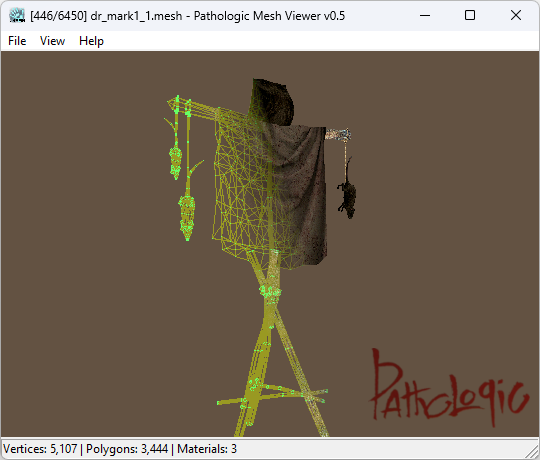

# Pathologic Mesh Viewer

A 3D model viewer for Pathologic Classic HD that supports the .mesh file format used in the game.



This tool makes possible to load and explore the game's 3D assets.

> **Note:** Pathologic Mesh Viewer is still under development and may not fully support every `.mesh` file from the game.


## How to Use

1. **Download or Build the Viewer**
    - [Download a prebuilt version](https://github.com/koshkokoshka/pathologic-mesh-viewer/releases) or build the project from the source code.

2. **Prepare the Game Assets**
    - Extract `Geometries.vfs` and `Textures.vfs` archives located in game data folder.

3. **Open a Model**
    - Use Pathologic Mesh Viewer to open any `.mesh` file from the extracted assets.

---

## Specification

### .mesh file structure (NOT COMPLETE)

See [`src/load_mesh.c`](https://github.com/koshkokoshka/pathologic-mesh-viewer/blob/master/src/load_mesh.c) for details

The following structure is a .bt template for the [SweetScape 010 Editor](https://www.sweetscape.com/010editor/):

```c++
struct {
    // type=0 - pond_water.mesh
    // type=2 - imnogogrannik.mesh
    // type=4 - iboiny.mesh, ihidden_room.mesh
    // type=5 - pulya6.mesh
    local int type = 4;

    if (type == 0) {
        int vertices_count;
        struct {
            float x, y, z;
        } vertices[vertices_count] <optimize=false>;
        int indices_count;
        struct { short a, b, c; } indices[indices_count];
        float unknown_1[3];
        float unknown_2[3 * vertices_count];        
    }
 
    if (type == 1) {
        int vertices_count;
        struct {
            float x, y, z;
            float u, v;
        } vertices[vertices_count] <optimize=false>;
        int indices_count;
        struct { short a, b, c; } indices[indices_count];
        char texture_name_length;
        char texture_name[texture_name_length];
        float unknown_2[9];        
    }
 
    if (type == 2) {
        int unknown_1;
        struct {
            byte unknown_1;
            float unknown_2;
            float unknown_3;
            float unknown_4;
            float unknown_5;
        } unknown_2[6];
        char unknown_3[9];
        float unknown_4[3];
        int unknown_5;
        byte unknown_6;
        int unknown_7;
        int unknown_8[unknown_7];
        byte unknown_9[12];
    }
 
    if (type == 3) {
        int unknown_1;
        int submesh_count;
        struct {
            // material_type=33 - isobor_lampa.mesh
            // material_type=33 - icot_eva_Kerosinka.mesh
            // material_type=17 - inv_grass_white_plet.mesh
            // material_type=17 - r4_house3_01.mesh
            int unknown_1;
            int material_type; // probably material flags
            if (material_type == 0) {
                char unknown_3;
                float unknown_4[6];
            } else {
                if (material_type == 1 || material_type == 17) {
                    char unknown_3;
                }
                char texture_name_length;
                char texture_name[texture_name_length];
                if (material_type == 1 || material_type == 33) {
                    char unknown_4;
                }
            }
            int vertices_count;
            int indices_count;
            float unknown_5[19];
            if (material_type == 0 || material_type == 1 ||  material_type == 17) {
                int unknown_block_count;
                local int i;
                for (i = 0; i < unknown_block_count; i++) {
                    struct {
                        int unknown_1; // probably id
                        float unknown_2[15];
                        int subblocks_count;
                        if (subblocks_count > 0) {
                            struct {
                                int unknown_4;
                                int unknown_5;
                                int unknown_array_length_1;
                                char unknown_7[unknown_array_length_1];
                                int unknown_array_length_2;
                                char unknown_9[unknown_array_length_2];
                                int unknown_array_length_3;
                                int unknown_array_length_4;
                                struct { short a, b, c, d; } unknown12[unknown_array_length_4];
                                float unknown_13;
                            } subblocks[subblocks_count] <optimize=false>;
                        }
                    } unknown_block;
                }
            }
        } submeshes[submesh_count] <optimize=false>;
        local int i;
        for (i = 0; i < submesh_count; i++) {
            struct {
                byte vertex_type;
                if (vertex_type == 1) {
                    struct {
                        float unknown2;
                        float unknown3;
                        float unknown4;
                    } unknown_1 <optimize=false>;
                }
                struct {
                    if (vertex_type == 0) {
                        float x;
                        float y;
                        float z;
                    } else {
                        short x;
                        short y;
                        short z;
                    }
                    if (submeshes[i].material_type == 0) { // ihouse2_krovatka01.mesh
                        int unknown_6;
                        if (submeshes[i].unknown_3 == 1) { // iboiny_railing01.mesh
                            int unknown_6;                        
                        }
                    }
                    if (submeshes[i].material_type == 1) {
                        int unknown_1;
                        float u, v;
                        if (submeshes[i].unknown_3 == 1) { // iboiny_railing01.mesh
                            int unknown_6;
                        }
                    }
                    if (submeshes[i].material_type == 17) {
                        int unknown_1;
                        float u, v;
                        if (submeshes[i].unknown_3 == 1) {
                            int unknown_6;
                        }
                    }
                    if (submeshes[i].material_type == 33) {
                        float u, v;
                    }
                } vertices[submeshes[i].vertices_count] <optimize=false>;
                struct { 
                    short v1, v2, v3; 
                } indices[submeshes[i].indices_count] <optimize=false>;
                if (submeshes[i].material_type == 0 || submeshes[i].material_type == 1 || submeshes[i].material_type == 17) {
                    local int j;
                    local int k;
                    for (j = 0; j < submeshes[i].unknown_block_count; j++) {
                        for (k = 0; k < submeshes[i].unknown_block[j].subblocks_count; k++) {
                            struct {
                                short unknown1;
                                float unknown2;
                                float unknown3;
                                if (submeshes[i].unknown_3 == 1) {
                                    short unknown4;
                                    short unknown5;
                                }
                            } unknown[submeshes[i].unknown_block[j].subblocks[k].unknown_array_length_3] <optimize=false>;
                        }
                    }
                }
            } verts;
        }
        float unknown_2[50];
        char unknown_3;
    }
 
    if (type == 4) {
        int unknown_1;
        struct {
            byte unknown_1; // 2
            float unknown_2;
            float unknown_3;
            float unknown_4;
            float unknown_5;
        } unknown_2[6];
        byte unknown_3[5];
        int unknown_4;
        struct {
            int unknown_1;
            int unknown_2;
        } unknown_5[unknown_4];
        float unknown_6;
        float unknown_7;
        float unknown_8;
        int unknown_9;
        byte unknown_10;
        if (unknown_10 == 3) {
            struct {
                int unknown_1;
                int unknown_2;
                int unknown_3;
                struct {
                    byte unknown_1; // 2
                    float unknown_2;
                    float unknown_3;
                    float unknown_4;
                    float unknown_5;
                } unknown_4[5];
                byte unknown_5;
                int unkonwn_6;
                int unkonwn_7;
                float unknown_8;
                float unknown_9;
                float unknown_10;      
                int unknown_11;
                byte unknown_12;
            } unknown_11;
        }
        int unknown_12;
        int unknown_13[unknown_12];
        int unknown_14;
        struct {
            float unknown_1;
            float unknown_2;
            float unknown_3;
            float unknown_4;
            float unknown_5;
            float unknown_6;
            float unknown_7;
            float unknown_8;
            float unknown_9;
        } unknown_15[unknown_14];
        int unknown_16;
        int unknown_17;
    }
 
    if (type == 5) {
        int mesh_count;
        int unknown_1;
        int unknown_2;
        byte unknown_3;
        byte texture_name_length;
        char texture_name[texture_name_length];
        byte unknown_4;
        int vertices_count;
        int indices_count;
        float unknown_5[19];
        byte unknown_6;
        float unknown_7;
        float unknown_8;
        float unknown_9;
        struct {
            short x;
            short y;
            short z;
            char unknown_1[4];
            float u;
            float v;
        } vertices[vertices_count];
        struct {
            short unknown_1;
            short unknown_2;
            short unknown_3;
        } indices[indices_count];
        float unknown_10;
        float unknown_11;
        float unknown_12;
        float unknown_13[12];
    }
} model;
```